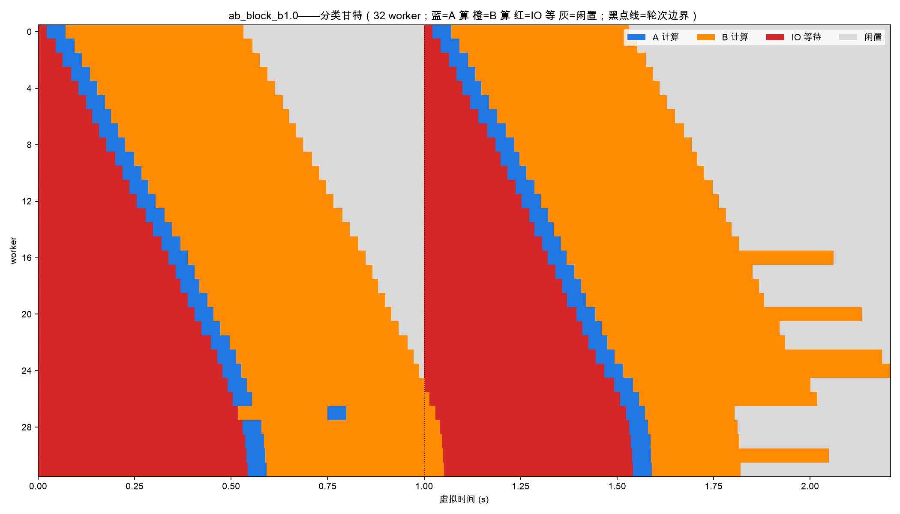
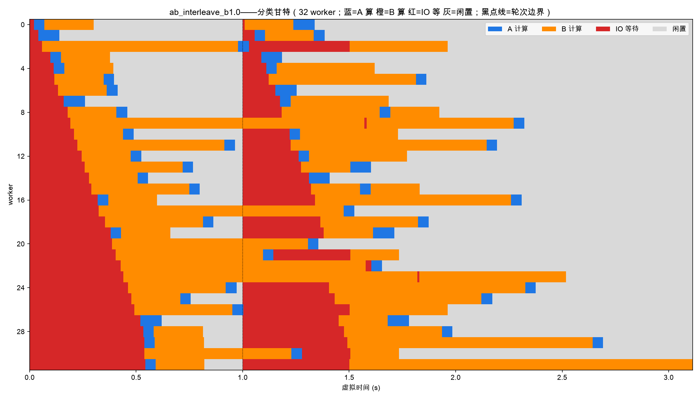
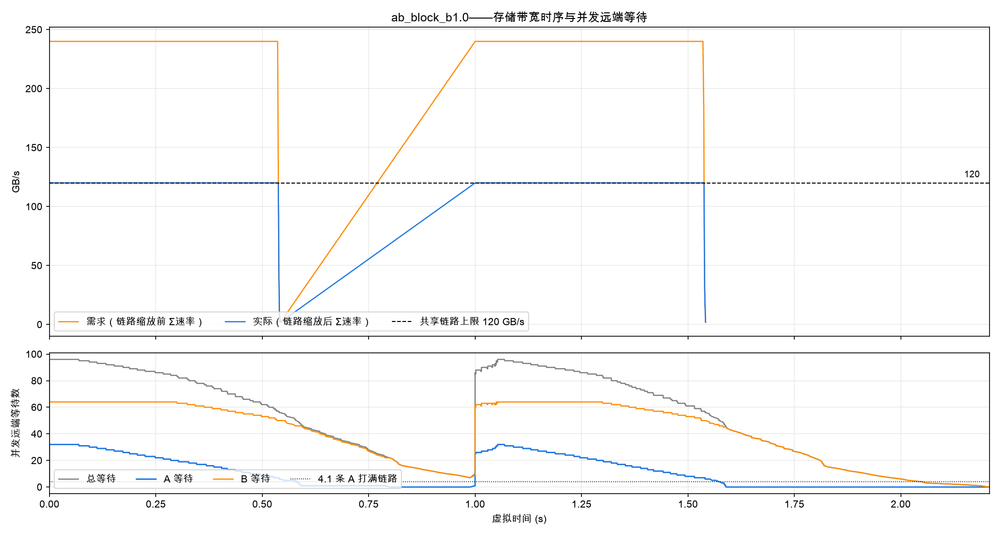
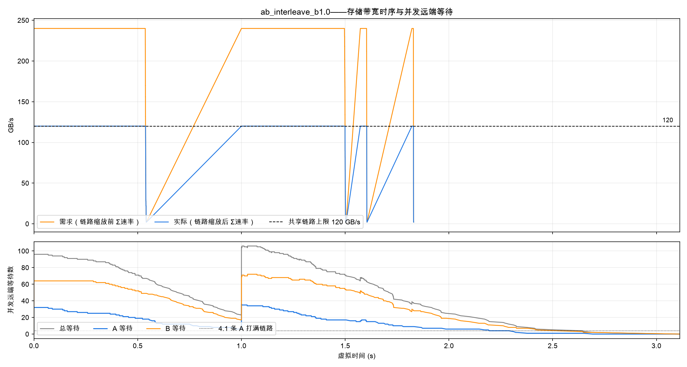

# 实验结果：A/B 双类带宽争抢——dynamo_vllm_simulation 首轮（块状 vs 交错到达）

| 项目 | 约定 |
|---|---|
| 日期 | 2026-10-08 |
| 定位 | 首轮结果文档：E26 工况（A/B 双类带宽争抢）移植到本实验台的两到达序对照；设计与标定见 [AB双类带宽争抢实验设计-20261008.md](AB双类带宽争抢实验设计-20261008.md)，验收数值见包内 `VALIDATION.md` 追记 |
| 工况 | E26 大纲移植：32 worker（Dynamo 真实负载感知路由）、共享链路 120 GB/s 唯一瓶颈、`max_num_seqs=1`（=batch 1）、A:B=1:2；A 读 1.4052GB/算 48.13ms、B 读 0.30798GB/算 228.72ms（虚拟 token 标定，误差 ≤0.05%） |
| 规模 | 192 请求 = 每轮 32A+64B 同刻到达 × 2 轮、轮距 1.0s；两臂同 config、同到达时刻，仅 id 顺序不同（CRN） |
| 复现 | `python -m sim.run --config configs/ab.json --trace results/traces/ab_{block,interleave}_r2_b1.jsonl --output results/ab_*`（需 `VLLM_ALLOW_LONG_MAX_MODEL_LEN=1`，trace 由 `scripts/gen_ab_trace.py` 生成）；图 `scripts/ab_fig.py`（本文四图均过 --audit 守恒断言） |

> **注（2026-10-10）**：本文数值产生于旧存储 Path 语义（块哈希定位 (盘, Path)）。该语义已按 [docs/存储带宽分配策略设计-maxmin-20261009.md](docs/存储带宽分配策略设计-maxmin-20261009.md) 改为"块只落 ASU、IO 请求发出时指派 Path"（两带宽策略共用），五模式基线已重跑（见包内 VALIDATION.md 追记），本文两臂未重跑。机制性判断（异步 KV 提交、链路超订、到达序作用于计算队列次序）不受 Path 指派方式影响，具体数值请以新语义重跑为准。

---

## 0. 总判决

1. **守恒与 CRN 成立**：两臂读量逐位一致（129.3547 GB = trace 声明）、compute 合计逐位一致（32.671s）；链路饱和（≥90%×120 GB/s）时长两臂均为 1.076s ≈ 理论排空下限 2×0.539s——**链路是绑定瓶颈且传输期内满利用**（带宽图 ∫actual=bytes_read，误差 1e-11）。
2. **E26d 的"块状→洪水、交错→天然错峰"不迁移**：真实 vLLM 异步 KV 加载让每 worker 队列内全部请求的远端读立即提交，两臂并发 A 峰值 32/36（4.1 条 A 即打满链路，超订 ~7.8×），A 类 TTFT 均为读分摊主导（~360ms ≈ 1.405GB ÷ 120/32 GB/s）。**读不受准入控制，到达序不改变读并发结构**。
3. **到达序的真实作用点 = 每 worker 计算队列次序**：块状臂 32 个 worker 首位全是 A（A 先算：makespan 2.208s、A 类 SLO 28.1%）；交错臂经 Dynamo 按 token 负载加权分布后首位 11A/21B，A 排在 B 的 228.72ms prefill 之后，TTFT 随队列深度单调恶化（第 0 位 345ms → 第 7 位 1533ms；makespan 3.112s、A 类 SLO 18.8%、尾部纯计算拖长 1.28s）。
4. **复现性注记（重要）**：Dynamo 原生 picker 平局随机使 ~185/192 请求的 worker 落点在复跑间变化——均值类指标漂 0.3~2.1%，最值类（makespan/p95）漂 1.2~10.9%（详见 §6）；正式对照实验前需落地确定性 picker 或多种子取中位数。

## 1. 汇总表（SLO%；A%/B% 分类满足率；TTFT 秒；concA=并发远端等待 A 数 p50 口径见 records）

| 臂 | makespan | A 类 TTFT mean/p95 | A 类 SLO | B 类 TTFT mean/p95 | B 类 SLO | concA 峰/p90 | 总并发峰 | 报告 |
|---|---:|---|---:|---|---:|---|---:|---|
| 块状（32A 在前，E26d D3 复刻） | 2.208 | 0.364 / 0.588 | 28.1% | 0.708 / 1.048 | 83.6% | 32 / 31 | 96 | `results/ab_block_b1.0` |
| 交错（(A,B,B)×32，E26 D2 类比） | 3.112 | 0.632 / 1.355 | 18.8% | 0.856 / 1.577 | 65.6% | 36 / 34 | 106 | `results/ab_interleave_b1.0` |

按类 SLO = α×单条理想 TTFT（α=4：A 239.4ms、B 925.1ms；本仓库无逐层 I/O，单条理想=全量读+prefill，A 59.8ms、B 231.3ms）。两臂 compute 32.671s 逐位一致；stall 19.7/17.7s、idle 18.3/49.2s。**交错臂在所有口径上不优反劣**（makespan +41%、A 类 SLO −9.3pp、B 类 −18.0pp）。

## 2. 图 A：分类甘特（蓝=A 算 橙=B 算 红=IO 等 灰=闲置；行=worker 0–31；黑点线=轮次边界）

### 2.1 块状臂



**读法**：两轮整齐的"红→蓝→橙→灰"斜坡——每轮开始 32 worker 全红（A 的 1.4GB 读在链路上互拖，~370ms），随后蓝（A 算，48ms×短）铺开，再橙（B 算，229ms×长）成排；轮间灰隙为负载间歇。第一波全红即"E26d 洪水"的形态，但它与交错臂同样出现（见 2.2）——洪水由"全部读立即提交"决定，与到达序无关。

**关于斜坡与灰隙宽度按 worker 序号递减（相关 −0.78）的说明**：每轮 96 条请求全部**同刻到达**（t=0 / t=1.0，所有 worker 首次活动时刻均为 0.0），灰不是错峰到达，而是"轮 1 干完 → 等 t=1.0 轮 2"的间歇。灰隙宽度的阶梯来自 harness 顺序效应：t=0 时刻事件循环按 worker 序号 0→31 依次调用各 engine 的 schedule()，读按此序进入存储路径队列，而存储模型**每路径 FIFO、只服务队头**——同刻提交的一波读按提交序完成（本运行 worker 0 的 A 读 21ms 完成、worker 31 要 542ms，相关系数 +1.00；路由落点本身随机，与此无关）。定量闭合：每 worker 轮 1 提交 1A+2B = 11,760 块，摊 512 路径 ≈ 23.0 块/路径，满发下每块 171,868B ÷ 234.4MB/s ≈ 0.733ms → 每隔一个 worker 阶梯 ≈ 16.8ms，31×16.8 ≈ 522ms ≈ 实测阶梯宽 521ms。于是低序号 worker 最早干完轮 1、灰隙最长。"一波同刻提交 → FIFO 波次完成"的形态真实存在，但**严格按 worker 序号单调是 harness 引擎遍历顺序的伪影**（真实系统由网络/线程到达次序决定），判读甘特时不应把该斜坡解读为到达错峰。另注：这是本仓库存储模型（路径队头 FIFO）与 E26 引擎（流间处理器共享，32 条 A 同时各分 120/32、约同时完成、无阶梯）的本质差异，不是负载差异。

### 2.2 交错臂



**读法**：蓝/橙/红小块交错、无整齐斜坡；多数 worker 以橙（B 算）开局（首位 11A/21B），A 的蓝条被推到 B 之后；尾部（t≈1.8s 后）只剩零星橙条在深队列里排队——makespan 被纯计算尾巴拖到 3.112s。灰区显著多于块状臂（idle 49.2s vs 18.3s）：负载被 Dynamo 的 token 加权分布压到部分 worker 上，其余提前无活可干。

## 3. 图 B：存储带宽时序（上=需求 vs 实际 +120 GB/s 上限；下=并发远端等待数）

### 3.1 块状臂



**读法**：上面板两轮各现一个"橙 240 → 蓝 120"平台：需求（盘/路径层 Σ速率，上限=2 盘聚合 240 GB/s）一开即顶格，实际被链路压平在 120——**超订 2×、链路全程饱和**；轮间回落到 0，最后传输事件 t=1.542s，其后 0.67s 为纯计算尾巴。下面板第一波 A 等待冲到 32（=E26d concA 口径），与甘特首波全红互证。注意本仓库"需求"口径与 E26 的 Σ申请率（可达 53×容量）不同：处理器共享模型下需求结构性 ≤240 GB/s。

### 3.2 交错臂



**读法**：带宽形态与块状臂几乎相同（饱和 1.076s=下限、需求 240、实际 120）——再次说明**读侧的争抢结构与到达序无关**；差别只在下面板与尾部：总并发等待峰值 106（块状 96）、A 峰 36，且深队列让最后传输拖到 t=1.830s、计算尾巴 1.28s。

## 4. 机制：队列位置 → A 类 TTFT（交错臂）

| A 在 worker 队列的位置 | 0 | 1 | 2 | 3 | 4 | 5 | 6 | 7 |
|---|---|---|---|---|---|---|---|---|
| n | 11 | 10 | 13 | 9 | 10 | 6 | 1 | 2 |
| A 类 mean TTFT (s) | 0.345 | 0.460 | 0.474 | 0.656 | 0.742 | 0.947 | 1.309 | 1.533 |

每排在一个 B（228.72ms prefill）之后约 +0.1~0.2s，单调恶化；块状臂 A 全部在首位/次轮首位（0.370/0.357s）。**这就是"到达序"在本实验台的唯一作用通道**：它决定 Dynamo 把谁先放进 worker 的 FCFS 计算队列，而不是决定谁先读。

## 5. 与 E26d 的对照：为什么不迁移

| | E26 引擎（status_aware_network） | 本实验台（真实 vLLM 0.20.2） |
|---|---|---|
| 读的准入 | 派单即占用 worker，读期间 worker 阻塞 → **队列序=读并发结构** | 异步 KV 加载：`WAITING_FOR_REMOTE_KVS` 不占 running 槽（scheduler.py:798-818），队列内全部请求读**立即并发提交** |
| 交错序的效果 | 首波混批 → 并发 A ~11，天然错峰 | 读并发不受影响（并发 A 仍 ~32-36），只改变计算队列次序 |
| 错峰的获得方式 | 需 MPC 推演控制派单 | **"B 算与 A 读重叠"天然存在**（图 A 中橙蓝同刻并存），但 A 之间的互拖无人治理 |
| 结论 | 交错序占优（E26d：块状 FCFS 66.7% vs D2 交错 78.1% SLO） | 块状序占优（2.208s vs 3.112s makespan，方向相反） |

机理一句话：E26 的洪水来自"调度器把 32 条 A 同时放进系统"；本实验台的洪水来自"存储层对已排队读不做准入控制"。前者是调度问题，后者是 **admission/背压问题**——对应检视报告 §4.1 的 P/B 层挂载点缺口：限制同时处于远端等待的重读请求数（如 ≤4）才是本语义下"错峰"的正确形态。

## 6. 复现性注记（两轮同配置对照）

同 trace 同 config 复跑（第二轮为补记存储区间日志的重跑，调度代码路径无变化）：

| 指标 | 块状 r1→r2 | 交错 r1→r2 |
|---|---|---|
| bytes_read / compute 合计 | 逐位一致 | 逐位一致 |
| mean TTFT | +0.28% | +2.12% |
| p95 TTFT | +1.29% | +2.11% |
| makespan | −1.18% | **+10.89%** |
| worker 落点变化 | 185/192 | 183/192 |

原因：Dynamo 原生 picker 同代价平局随机（检视报告 §2.3.4 既知缺口）。12 请求 demo 中表现为"标签对调、汇总不变"；本负载 192 请求非对称，平局差异经 FCFS 队列放大到汇总层。**判读规则：均值类指标 ±2% 内视为同分布；makespan/p95 等最值类波动可达 ~11%，单次运行不足以下细粒度结论。**

## 7. 局限

- 虚拟 token 标定（A 重算 862/字面 256）：对调度有意义的每类读字节/计算时间精确匹配，token 数语义已变（设计文档 §2，不得隐瞒）。
- 无逐层 I/O：收齐全部块才计算，单条理想 TTFT 比 E26 的 T0 多算读时；"需求"口径为盘/路径层 Σ速率（≤240 GB/s），非 E26 的 Σ申请率。
- decode_token_s 任意取值（=prefill 系数）；output=16 只影响 finish 不影响 TTFT。
- Dynamo 平局随机（§6）；本报告数值为单次运行。
- harness 顺序效应：同刻提交时事件循环按 worker 序号 0→31 依次提交读，存储路径 FIFO 使完成时间按序号阶梯（+1.00 相关，见 §2.1）——真实系统同刻提交顺序由网络/线程到达次序决定，该阶梯不应解读为到达错峰。
- 甘特重建假设 prefill/decode 系数相等（本 config 成立；--audit 守恒到 1e-16 时该假设自证）。

## 8. 复现命令

```bash
cd dynamo_vllm_cpu_sim
.venv/bin/python scripts/gen_ab_trace.py --order block && .venv/bin/python scripts/gen_ab_trace.py --order interleave
export VLLM_ALLOW_LONG_MAX_MODEL_LEN=1
.venv/bin/python -m sim.run --config configs/ab.json --trace results/traces/ab_block_r2_b1.jsonl --output results/ab_block_b1.0
.venv/bin/python -m sim.run --config configs/ab.json --trace results/traces/ab_interleave_r2_b1.jsonl --output results/ab_interleave_b1.0
.venv/bin/python scripts/check_results.py results/ab_block_b1.0 results/ab_interleave_b1.0
.venv/bin/python scripts/ab_analyze.py results/ab_block_b1.0 results/ab_interleave_b1.0
.venv/bin/python scripts/ab_fig.py results/ab_block_b1.0 --tag block --audit      # 图输出 ../docs/figures/
.venv/bin/python scripts/ab_fig.py results/ab_interleave_b1.0 --tag interleave --audit
```

## 9. 通俗版

把共享 KV 存储想成一条 120 GB/s 的水管。E26 那边的调度员（引擎）一次只派一个工人去接水，所以"排队顺序"决定了同时有多少人挤在水管上——把 A 们错开排，水管就不挤了。本实验台的真实 vLLM 更像"自助取水"：工人们一进队就全把桶接上水管（异步加载），排队顺序只决定谁先回工位干活（计算），不决定多少人同时接水。所以两臂的水管都挤爆（并发 A≈32，管子超订 2 倍、全程满流），交错排队不再省水——反而因为 Dynamo 把活儿分得不匀、A 排在慢活儿（B 的 229ms 计算）后面，整体更慢。要治水，得装"阀门"（admission 控制：同时接水的重桶 ≤4 个），而不是调整排队顺序。
