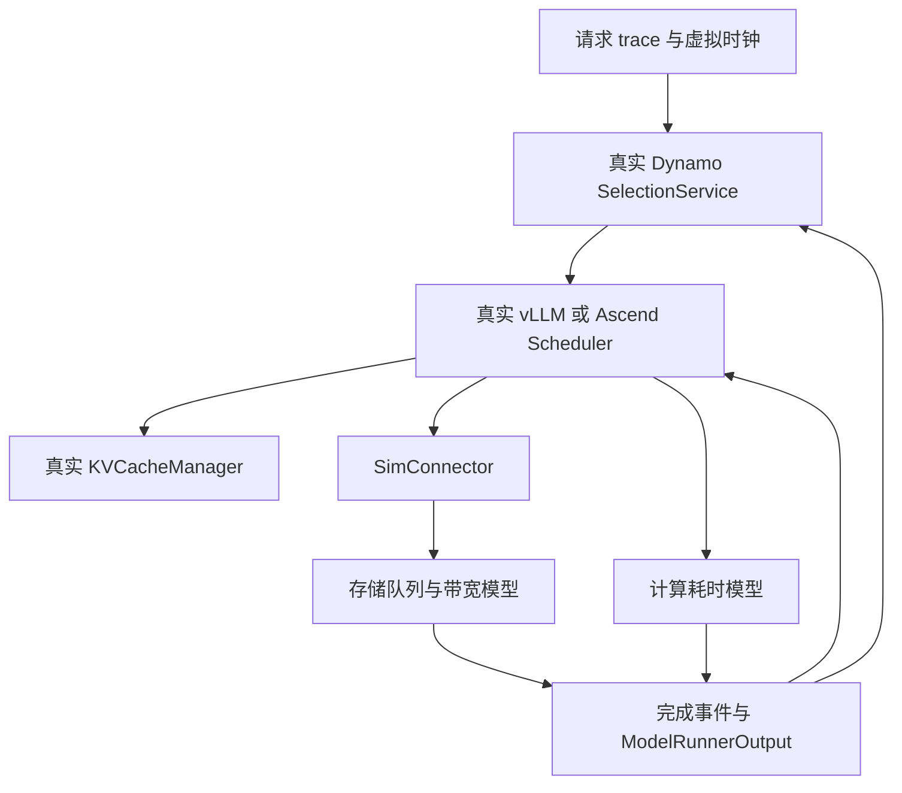
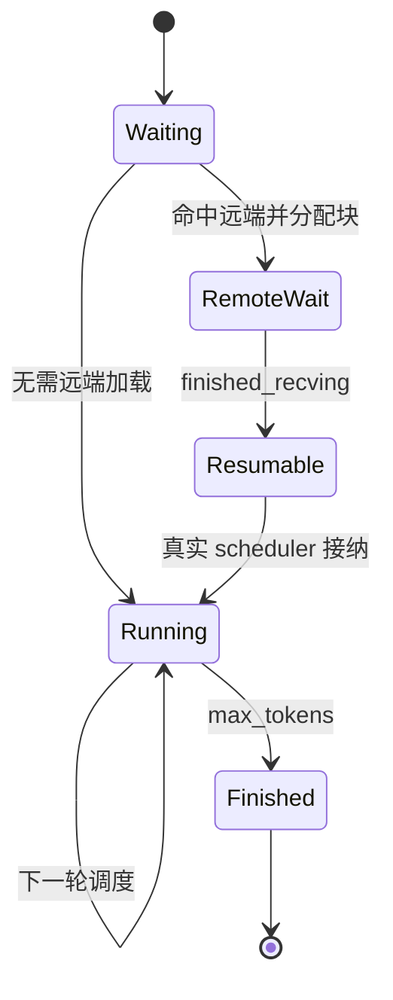

# 在 CPU 上运行真实 Dynamo / vLLM / vLLM-Ascend 调度代码：可行性与实施设计

版本核对及工程验证日期：2026-09-24。配套代码见同目录；文中明确区分已交付实现、后续设计和实机校准任务。

## 1. 判断：可行，但“真实代码”必须定义到具体边界

这个方向适合研究路由、批处理、KV 缓存和存储状态联合调度。最有价值的保真对象是**做决策的程序、它读到的状态，以及外部事件回来时发生的状态转换**。保留这些代码，确实比另写一套“近似 vLLM”的调度器更容易把实验策略迁回生产。

但不能得出“使用真实源码，性能预测就自动真实”的结论。NPU kernel、图捕获、设备 stream、HCCL、内存带宽和存储 I/O 都影响事件顺序。如果 mock 全部立即成功，调度器虽然是真的，它看到的世界却是假的。正确做法是在真实程序的执行边界上放入**有资源竞争、有延迟、有完成语义的执行模型**。

需要分别考察三个维度：

| 维度 | 要保留什么 | 本次交付 |
|---|---|---|
| 决策保真 | 路由选择、队列、预算、KV 分配、请求状态机 | 真实 Dynamo selection core、真实 vLLM Scheduler/KV 管理；指定 Ascend scheduler 文件 |
| 因果保真 | KV 就绪才恢复、分配成功才执行、完成才释放、并发共享资源 | 已实现只读存储/同步 scheduler 的事件闭环；其他功能见边界 |
| 性能保真 | 每类算子/批次/通信/存储的时间模型 | 仅提供示例系数和动态存储模型，需实际 NPU/存储数据校准 |

**推荐路线：先采用“真实调度核心 + 仿真执行器”的实验台，再逐步接完整服务与 EngineCore。** 如果要求“所有 vLLM-Ascend Python 路径都原样执行，只把底层 NPU 函数改成 no-op”，工程会变成半个 Ascend 运行时仿真器，投入大且更容易隐藏错误。

本工程可以直接安装并跑通，但并未声称把整个 Dynamo/vLLM/Ascend 服务栈移植到了 CPU。特别是“按文件加载 Ascend BalanceScheduler”与“完整 Ascend 插件在 CPU 注册并运行”是两个不同完成度。

### 直接搭建入口

在 Linux x86_64 上安装 uv 后，解压配套代码包并执行：

```bash
unzip dynamo_vllm_cpu_sim.zip
cd dynamo_vllm_cpu_sim
bash scripts/bootstrap.sh
```

脚本自动下载固定 SHA 的源码、创建 Python 3.12 环境、安装 CPU 依赖并运行默认案例。后续用 `.venv/bin/python -m sim.run` 运行实验；详细开关见包内 README.md。无源码、无虚拟环境的新目录启动也已验证。需要网络获取首次依赖，不需要模型权重或 NPU。

## 2. 版本固定与兼容性

| 组件 | 固定版本 | 源码提交 |
|---|---|---|
| vLLM | v0.20.2 | `bc150f50299199599673614f80d12a196f377655` |
| vLLM-Ascend | v0.20.2rc1 | `367b8e62da799870a7476ce34f5f7658589a8aad` |
| Dynamo | v1.5.0，本方案选定 | `b83b1d9304ebfc624709ac46db32b1b6f1ff1615` |
| 仿真 Python | 3.12 | 本次验证 3.12.14 |
| 仿真 PyTorch | 2.11.0+cpu | 不安装 torch_npu/CANN |

用户未指定 Dynamo 版本，这里选 v1.5.0，是因为它提供独立 SelectionService 以及正式的自定义 worker selection 接口。**Dynamo 1.5.0 官方发行组合采用 vLLM 0.28.0，不能宣称它的整套 vLLM adapter 对用户指定的 0.20.2 已获兼容验证。** 本工程绕开引擎适配组合，使用真实 Rust 路由核心与真实 vLLM 0.20.2 scheduler 的显式桥接。这是我们定义并测试的集成边界。

安装 `ai-dynamo-runtime==1.5.0` 使用官方编译 wheel；下载对应 Dynamo 源码便于审阅和后续修改。仅编辑下载的 Rust 文件不会改变已安装 wheel，必须重编译。vLLM 则为 editable 源码安装，修改 Python 调度器后即可生效。

`VLLM_TARGET_DEVICE=empty` 用来安装不编译设备扩展的 vLLM Python 源码。本工程同时明确设置 `CpuPlatform`，避免不受控设备自动发现；这不等于使用 vLLM CPU backend 做数值推理。示例 OPT config 只提供配置元数据，不下载权重、不执行模型、不初始化 tokenizer。

安装 lock 有意裁剪生产依赖，因此它不是“vLLM/NPU 全功能环境”。新启用任何可选路径，都应先审查该路径新增的导入、native op、依赖和状态协议。

## 3. 两类运行形态

### 3.1 本次交付：离散事件实验台



多个逻辑 worker 各自有真实 scheduler 和 KV block pool，共享一个存储系统和虚拟时间。Dynamo 的 selection/reservation 状态是真实 Rust 对象。仿真没有 HTTP/IPC 转发成本；需要研究它们时，应建立独立延迟模型或第二类运行形态。

### 3.2 后续：完整服务闭环

让真实 Dynamo frontend、发现机制和 worker 接口运行；每个 worker 是真实 vLLM EngineCore + SimExecutor，底层存储/计算仍由模型完成。它适合验证 API、取消、跨进程协议、服务发现、PD 交接等完整行为。

可以先用壁钟缩放模式验证服务协议；若要高速离散事件推进，必须让跨进程 participants 在各自事件边界上暂停/恢复，统一协调虚拟时间。只给 Python 打补丁替换 `time.time()` 无法控制 Rust/Tokio 定时器、IPC、native 线程或真实进程超时。

Dynamo 自带 Mocker 是可参考的校准/对照工具，但其中对 vLLM 风格调度的模拟不能替代用户要求的特定版本 Python Scheduler。二者适合对照，不应混称为同一保真等级。

## 4. 保留、替换和暂不执行的代码

| 组件/路径 | 本工程处理 | 原因 |
|---|---|---|
| Dynamo SelectionService、选择和负载预留 | 原生 wheel 中的真实 Rust 代码 | 路由决策不能在 Python 重写 |
| Dynamo 服务发现 | 显式 upsert_worker | 固定拓扑实验无需部署控制面 |
| Dynamo KV 索引事件 | 当前关闭 | 未桥接真实事件时不能伪称 cache-aware |
| vLLM Request/SamplingParams | 真实对象 | 保留长度、优先级和停止状态协议 |
| vLLM Scheduler/queue/KVCacheManager/block pool/hash | 原样执行 | 保留调度和逻辑块分配行为 |
| Ascend BalanceScheduler | 按真实文件加载 | 避开与本实验无关的 CANN 全量导入 |
| KVConnector scheduler 接口 | 自定义真实接口实现 | 让外部 KV 影响真实状态机 |
| NPU forward/sample/通信 | 生成定时完成的 ModelRunnerOutput | 需要时间与生命周期，不需要数值结果 |
| HBM/Host/存储内容 | block ID、引用、位置和字节数 | 逻辑容量约束由真实 allocator 执行，无需分配 TB 张量 |
| EngineCore/ModelRunner/worker | 当前不实例化完整栈 | 第一阶段直接驱动调度核心 |
| CANN/torch_npu/NIXL/RDMA | 当前无需安装 | 对应动作由执行边界模拟，未实现的入口显式报错 |

关键边界是 SchedulerOutput → 执行 → ModelRunnerOutput；不要 mock `schedule()` 返回一个自编的批次，不要自行重写 KV allocator，也不要绕过真正的 `update_from_output()`。

## 5. 已核对的源码接口

以下路径相对于脚本下载的三个仓库，锁定的 commit 见上表。

| 目的 | 实际入口 |
|---|---|
| vLLM 调度 | `vllm/v1/core/sched/scheduler.py`：`Scheduler.add_request/schedule/update_from_output` |
| 自定义 scheduler 注入 | `vllm/config/scheduler.py` 的 `scheduler_cls`；`vllm/v1/engine/core.py` 调用 `get_scheduler_cls()` |
| KV 分配/缓存 | `vllm/v1/core/kv_cache_manager.py`、`block_pool.py`、`kv_cache_utils.py` |
| 执行结果 | `vllm/v1/outputs.py`：`ModelRunnerOutput`、`KVConnectorOutput` |
| 外部 KV 协议 | `vllm/distributed/kv_transfer/kv_connector/v1/base.py`：`KVConnectorBase_V1` |
| 完整 EngineCore 的替换点 | `vllm/v1/executor/abstract.py`：`Executor` |
| Ascend balance | `vllm_ascend/patch/platform/patch_balance_schedule.py` |
| Ascend 实际存储边界 | `vllm_ascend/distributed/kv_transfer/kv_pool/ascend_store/backend/backend.py` |
| Dynamo Python 接口声明 | `lib/bindings/python/src/dynamo/_core.pyi`：`SelectionService` |
| Dynamo 自定义策略 | `lib/kv-router/src/scheduling/selector/policy.rs` |
| 策略注册/选择 | `lib/kv-router/src/services/selection/policy_registry.rs`、`catalog.rs` |
| 策略编译示例 | `examples/router/custom-policy-example/README.md` |

代码中的版本与关键文件哈希检查是为了尽早发现 API 漂移。正式实验另外保存自定义 patch、配置、trace 哈希、依赖 lock 和 seed；只记录版本号不足以复现策略改动。

## 6. 真实 vLLM 调度闭环的实现细节

每个 worker 创建真实 VllmConfig、KVCacheConfig、StructuredOutputManager 和 Scheduler。示例采用单个逻辑 FullAttention KV group、固定 block 数、chunked prefill、同步 scheduler、无 speculative decoding。

处理顺序为：

1. 创建真实 Request，用上游 SHA256 block hasher 计算连续前缀哈希。
2. Dynamo 选择 worker 并 reserve；随后对真实 scheduler 调用 `add_request()`。
3. `schedule()` 决定本轮请求、token budget、chunk 和块分配。
4. 读取真实 SchedulerOutput，为本轮建立计算事件；SimConnector 提交本轮实际触发的读请求。
5. 在虚拟完成时间构造 ModelRunnerOutput；如果有存储接收完成，同时附带 `KVConnectorOutput(finished_recving=...)`。
6. 调用真实 `update_from_output()`；取真实 EngineCoreOutput 中的新 token 与完成状态。
7. 首 token 通知 Dynamo `prefill_complete()`；完成后 `free_reservation()`；检查块可回收和无未完成请求。

有几个容易写错的点：

- 此版本 `schedule()` 自己推进 `num_computed_tokens`。仿真器如果再加一次，就会提前完成 prefill。
- chunked prefill 没到采样点时，不能每一轮都伪造一个输出 token。只有本轮已覆盖 request 需要的 token 时才产生一个样本。
- 本轮计算 token 数为零，也可能必须处理 connector completion。不能用 `if not scheduled_tokens: return` 丢掉状态更新。
- 结束时的“free blocks”包含可回收的缓存块，不意味着所有 prefix hash 都被删除。128 块配置下，上游保留一个 null sentinel，报告 127 块可回收是预期。
- 示例固定产生 token ID 100，ignore_eos、按 max_tokens 停止。它适合短输出调度实验，不代表模型生成内容；长输出或多轮语义缓存实验应回放真实输出 token。
- 本版启动包没有调用长输出的增量 `SelectionService.add_output_block()`，因此建议 output_tokens < block_size。研究长 decode 前要按 block 边界接反馈，并验证原生 decode load 记账语义。

真实 allocator 和 preemption 代码没有被替换，但默认案例未制造 HBM 紧张抢占。不能据此声称取消、抢占期间远端传输清理、重算和失效传播已经全面验证。后续应使用专门的容量受限/多次抢占负载验收。

## 7. 远端 KV 的正确异步语义

`SimConnector.get_num_new_matched_tokens(request, num_computed_tokens)` 从**本地已经匹配的连续前缀之后**继续找远端前缀。它返回新增 external token 数以及是否异步加载。不能把“存在的 KV”当作“已在设备可用的 KV”。

分配成功后 `update_state_after_alloc()` 才提交实际读；存储模型处理排队、启动延迟和传输。在所有必需 block 收完之前，真实 request 处于 WAITING_FOR_REMOTE_KVS。接收完成通过真实 `update_from_output()` 回传，下一次 schedule 才允许恢复。



完整命中时仍需考虑最后一个 token 的 logits 计算；示例限制远端命中到 `(prompt_len - 1)` 以内的完整块，不会把全部 prompt 都跳过而凭空生成首 token。

后续支持取消/失败时，完成事件必须携带 request generation 或 transfer ID：请求取消后晚到的 completion 不得恢复旧请求，重试不得重复释放同一批 block。写回场景还必须保留引用直至真实保存完成，不能在 submit save 时就发布“存储已存在”。

本工程只读池在 t=0 初始化，同一前缀对全部请求可见。它表达预置缓存快照，不表达“将未来请求产生的 KV 提前放入存储”。若 trace 的远端字段来自运行中的动态缓存，需要改成按时间提交写入/移除事件。

## 8. Ascend 适配：能保留的与需要解耦的部分

Ascend 插件并非一个只在末端调用 `torch.npu` 的薄壳。平台注册、patch 导入、设备特性、runner、通信与 KV 传输之间存在依赖。全局把 `torch_npu` 替成 MagicMock 很容易让本应失败的分支悄悄通过。

这里采用**范围明确的源码复用**：直接加载 rc1 的 `patch_balance_schedule.py`，使用其中的真实 BalanceScheduler，而不触发整个 `vllm_ascend.patch.platform` 包的初始化。该文件也包含对 EngineCoreProc 的补丁，本实验并不实例化完整 EngineCoreProc。

提供三个模式：

| 模式 | 调度实现 | 修改情况 |
|---|---|---|
| upstream | vLLM 0.20.2 Scheduler | 无修改 |
| ascend_default | rc1 BalanceScheduler，`enable_balance_scheduling=False` | 无修改；其 schedule 委托父类 |
| ascend_balance | rc1 BalanceScheduler，开关 True | 使用显式生成的副本补丁；单 rank |

在 balance=True + 本工程异步 KVConnector 的路径上，原始 rc1 的异步等待分支没有更新 `request.num_computed_tokens`，复现为重复加载/无法前进。对应上游 vLLM 路径会记录这一进度。因此提供以下局部差异：

```diff
 request.status = RequestStatus.WAITING_FOR_REMOTE_KVS
+request.num_computed_tokens = num_computed_tokens
 continue
```

补丁脚本核对原始文件哈希并要求唯一匹配；输出 `patched/ascend_balance_schedule.py` 和 diff，不改 upstream 文件。**这是针对 CPU 实验复现问题的修正，不是宣称已经验证 rc1 在所有 NPU 配置下有同一问题，也不是生产补丁批准。**

本地单 rank 测试只向 balance queue 填入本 worker 的 running 数；要研究多 DP rank，必须执行真实的跨 rank 状态更新/均衡逻辑，通信耗时再由模型替换。Ascend 的其他 scheduler 变体、重计算相关平台开关、动态 batch/profiling chunk 路径均应逐个建立兼容测试，不能从此处的成功推断全量可用。

## 9. 虚拟时间与异步一致性

仿真只维护一个全局时间。每次推进至下一个请求到达、计算完成、存储启动或存储完成事件；所有资源在这一时间段内按当前速率一起推进。遇到新 I/O 或旧 I/O 完成后重新计算带宽分配。

本实现先处理推进到当前时刻所产生的存储/计算完成，再接纳当前时刻的新请求；同一时刻的请求按 arrival_s、ID 排序。这是明确定义的 tie 顺序，实验报告应保留。

Dynamo native accounting 是异步的，await 外层函数不总等于所有负载快照已经更新。桥接层在 route/prefill/free 后检查真实 `loads()`，等其 active_requests 和 potential_prefill_tokens 收敛，再允许下一次决策。这个宿主 CPU 等待不计入虚拟推理延迟；超时作为仿真错误报出。

这种 fence 仅覆盖当前使用的原生记账路径，未控制所有 Rust 时钟。以后启用路由队列 timeout、缓存 TTL、KV events、指数衰减、异步 snapshot 等功能时，要额外设计虚拟时钟或明确的采样/交付事件。

Dynamo 默认 picker 对完全相同代价的候选仍可能有随机平局选择，即使 temperature=0 也不能承诺逐 worker 完全相同。当前 replay 的汇总值相同，但 worker 标签可能交换。需要严格复现时，应在真实 Rust WorkerPicker 中按 `(cost, stable_worker_id, dp_rank)` 明确比较，并用相同 picker 跑所有策略；也可以保留随机性，报告多次运行分布。

## 10. 存储模型：必须模拟共享瓶颈

默认模型有 2 个逻辑 disk，每 disk 256 个逻辑 path，disk 总预算 40 GB/s，单 path 上限 1 GB/s，全系统共享链路 10 GB/s，单次读启动延迟 100 μs。它们都是可改参数，不对应已校准设备规格。这里 GB 是十进制 bytes，Gb/s 必须先除以 8。

block 用稳定 rendezvous hash 映射 disk，再映射 path；每 path FIFO。对所有已启动的队头读，先按 disk 的活跃路径数分带宽并施加单路径上限，再用全局链路上限等比例缩放：

\[
r_p^{(0)}=\min(B_{path}, B_{disk(p)}/N_{active,disk(p)})
\]
\[
r_p=r_p^{(0)}\min(1,B_{shared}/\sum_q r_q^{(0)})
\]

这是本实验明确选定的分配策略，不宣称是实际存储控制器的固件调度，也不是完整 max-min fair 分配。低速路径剩余 disk 容量如何再分配、读写隔离、cache tiers、介质服务时间分布，都可按目标系统扩展。

不能对每个读在提交时写一个固定 `size / peak_BW` 的完成时间然后不再更新。示例单元测试刻意在传输中途加入另一个读：原请求完成时间必须后移，另一个结束后剩余读再加速。这正是存储状态影响调度策略的基础。

当前读取不会去重多个 worker 的同一 block，也没有设备侧压缩、RDMA pipeline、Host staging 或写回。是否允许合并相同读，是需要显式控制的实验选项。不要将 disk、host-to-device、NIC、PCIe/HCCS 都无条件视为独立峰值链路；共享路径要在同一资源图计账。

## 11. KV 字节数与显存容量要从真实模型配置推导

对常规 dense attention，一个 token 全模型的未分片 KV 大小近似为：

\[
S_{token}=2\times L\times H_{KV}\times D_{head}\times s_{element}
\]

然后按实际 TP/PP 分片、KV head 复制、缓存 dtype/量化尺度、padding、block layout 和额外元数据修正。不能对所有模型机械地除以 TP：例如 KV head 数不足时的复制行为会改变每 rank 负担。MLA、滑窗、混合 attention、Mamba 等结构需要独立 cache spec 和分组建模。

本启动包 `kv_bytes_per_token=131072` 只是存储字节模型参数；OPT config 和单层 FullAttentionSpec 只用于构造合法调度元数据，**它们不构成这个字节参数的实机校准依据**。逻辑 block 数控制真实 allocator 的容量；字节数控制 I/O 成本。正式实验必须把二者从同一模型/设备 profile 生成，避免容量和带宽模型彼此矛盾。

## 12. 逐层 I/O 与计算重叠：后续必须单独实现

当前 request 等到所需远端 KV 全部到达才恢复调度。它可以研究外部 KV admission、存储拥塞、路由和计算之间的因果关系，但不能预测 layerwise prefetch 与 attention 的重叠收益。

逐层模型应保留真实 worker/connector 调用顺序，在 `start_load_kv`、`wait_for_layer_load(layer)`、forward layer、`save_kv_layer` 等边界生成事件。对一个融合 batch，层 l 的开始时间至少满足：

\[
t_{start,l}=\max(t_{finish,l-1},\max_{r\in batch}t_{KV-ready,r,l})
\]

如果实现允许按微批/组分别推进，要以实际调度粒度替换这里的 batch，不能假定每个 request 都有独立 NPU 流程。预取窗口还受 Host/HBM staging 容量、DMA 队列和层依赖约束；提前加载越多可能占用越多带宽和块，损害其他请求。

该扩展完成前，不应把当前 `stall_s=0` 叫作“完美 I/O 覆盖”：worker 可能在等待某请求时执行其他请求，但这并未证明同一次 forward 内 I/O 被计算遮蔽。逐层模型应记录 ready、start、finish、wait 的独立事件，并与真实 trace 对齐。

## 13. 计算和通信时间模型

示例每轮耗时为：

\[
T_{step}=\alpha+\beta N_{prefill}+\gamma N_{decode}
\]

参数在 config 中，适合验证流程及人为构造瓶颈。它不能可靠外推吞吐，更不应用来报告某 NPU 的绝对性能。正式模型至少输入：模型/量化、设备型号、TP/PP、prefill/decode 数量、chunk 长度、上下文长度分布、批大小、图模式、MoE 活跃专家和通信拓扑。

建议采样实机的真实 SchedulerOutput 与相应 NPU event 时间，而不是只测 HTTP E2E。以 table lookup / 分段回归 / 可解释拟合建立时延面；测不到的区域标记外推范围。单独建模调度 CPU 开销、launch/同步、TP/PP 通信和存储，不要把同一段耗时重复加入两次。

使用未参与拟合的负载做验证，比较每步时间、TTFT 分布、吞吐、队列与抢占次数；更重要的是检查不同策略的排序是否稳定。真实业务的输出长度可用 trace 作为仿真停止条件，但策略若在生产不知道它，不能把准确长度当作无误差预测输入。示例向 Dynamo 提供 expected_output_tokens 是一个已知长度的控制实验假设。

## 14. “考虑存储状态”应暴露哪些信息

仅传一个 cache_hit_rate 或当前带宽是不够的。一个请求可能命中远端，但需要跨拥塞路径读很多字节；另一个请求命中少，却可在空闲 NPU 上很快重算。建议定义显式、带版本的 StorageSnapshot：

| 信息 | 内容与用途 |
|---|---|
| epoch / measured_at / delivered_at / expires_at | 模拟测量、传播延迟、过期，防止读取未来状态 |
| tier / disk / path / link 标识 | 将请求 block 映射到真实共享瓶颈 |
| queue depth / queued bytes / active transfers | 预测等待与服务时间，区分排队和传输 |
| capacity / reserved bandwidth | 避免多个选择者同时把全部带宽当空闲 |
| block metadata / contiguous prefix | 请求在设备、Host、共享存储各自能连续复用多少 |
| device staging / free blocks | 预测预取是否挤占正在运行请求 |
| estimate uncertainty / freshness | 过期或不可靠时降级到原策略 |

实现上，仿真存储拥有“真实状态”，策略只能读“已交付的观测快照”。通过 `snapshot_delay_s`、更新周期和噪声模拟生产观测；请求尚未到达时的未来输出、未来写回不能进入策略输入。snapshot 的过期时间也要使用虚拟时钟。

当前代码的 `Storage.snapshot()` 提供简化观测原型，默认路由还没有消费它。priority 示例只使用静态长度/预置前缀估计，不能把它叫成已实现的动态存储感知调度器。

## 15. 在真实 Dynamo 中修改路由策略

Dynamo 的真实扩展点包括 `WorkerFilter`、`WorkerScorer`、`WorkerPicker`。Filter 处理硬约束，Scorer 返回有限的 lower-is-better cost，Picker 从候选中选择；原来的 eligibility、reservation、accounting 生命周期仍由 Dynamo 持有。

一种候选目标函数是：

\[
C(w,r)=\widehat{TTFT}(w,r)+\lambda\widehat{Externality}(w,r)
       +\mu\,\max(0,\widehat{TTFT}(w,r)-SLO_r)
\]

其中 externality 是此次加载给同路径其他请求造成的增量等待，不应仅用“本请求读完要多久”。TTFT 要联合考虑本地计算排队、已有 KV、读取/重算选择、批处理和首 token 计算。系数由实验设计给定，不能仅凭示例数值宣布最优。

落地步骤：

1. 从固定提交的 `examples/router/custom-policy-example` 建自己的 Rust policy crate，声明需要的 CACHE / LOAD 等输入组。
2. 将存储观测通过显式扩展的 context 或按 request key 查询的已缓存 snapshot 注入。评分过程中不做每候选一次同步 RPC，以免改变控制面的时间开销。
3. 实现 StorageAwareScorer；需要严格可复现时实现确定性的 WorkerPicker。注意候选行顺序未定义，不能用行号当稳定 worker ID。
4. 在 catalog 中注册 provider/factory；YAML 定义实例和 worker type；构建启用 `custom-policy` 的 Python 扩展。
5. 仍用本工程 select_and_reserve / prefill_complete / free_reservation 桥接，不在 Python 外面重新挑选 worker。
6. 加入决策收据：候选输入、snapshot epoch、cost 分量、winner、fallback 原因。用构造的小例子验证是否真的加载了新策略。

**接口限制必须正视：** v1.5.0 的 WorkerSelectionContext 有 request_blocks、block_size、session context、expected_output_tokens 等公开 getter，但它没有向自定义 crate 直接公开任意 request ID / block→disk 映射 / 每盘队列。内部有 request_id 字段不代表插件可以访问它。WorkerInputs::CACHE 中的 tier overlap 也不等于存储 ASU/path 状态。因此完整实现需要扩展上下文或建立明确的共享状态桥，不能假造 `candidate.storage_queue` 一类不存在的 API。

编译入口在 `upstream/dynamo/lib/bindings/python`，官方示例使用 `maturin develop --uv --features custom-policy` 并将 `dynamo-worker-selection-policy-catalog` 依赖别名指向自己的 catalog。Rust 工具链和系统构建依赖按固定仓库说明准备。**本启动包未编译新的 Rust 存储策略；默认使用发行 wheel。** 修改 `upstream/dynamo` 后，先重建替换扩展，再运行基准，不能只改文件就认为策略生效。

编译后先用 policy 的专门用例确认选择改变，再做本工程集成验收。实验记录 wheel/build hash；doctor 只检查发行版本与关键源码，不能单靠版本号辨别两个不同自定义 build。

## 16. 在真实 vLLM/Ascend 中修改本地策略

有三个粒度，建议依次做：

1. **队列优先级。** 使用真实 `policy='priority'` 和 Request.priority 验证策略入口。当前脚本默认按未复用 prompt 长度赋静态 priority；这是调通修改链路的例子。
2. **动态 admission / prefetch 预算。** 根据已交付存储快照选择哪些 waiting 请求可以启动远端读取、限制在途字节/路径并发，并保留真实 allocate_slots 和异步状态机。
3. **token budget / batch composition。** 在真实 schedule 路径上联合选择当前 batch 的请求、prefill chunk 和 decode 预算；需同时考虑 NPU 利用率、KV 就绪和公平性。

使用 scheduler_cls 继承目标真实 scheduler，或对固定版本 schedule 做小范围 patch；迁回生产时复用同一策略类/patch。不要让仿真器在 schedule 外面预先组成假 batch，然后只把结果塞给真实 scheduler。

如果动态修改 heap 中已有请求的 priority，必须遵循原队列实现的重新入队/重建规则；直接改字段不等于 heap 排序会刷新。Ascend 自定义 queue/balance 路径可能有不同逻辑，要逐一验证。

公平性必须与性能一起设计：aging、最长等待保护、每租户份额、prefill/decode 饥饿约束和 admission 上限。否则只选短请求/空闲路径，均值可能好看而尾延迟和 SLO 更差。

建议做四组消融：原路由+原本地策略、存储路由+原本地策略、原路由+存储本地策略、两者一起。计算/存储模型、trace、初始缓存、观测延迟和随机性必须固定；否则无法判断收益来自策略还是环境变化。

## 17. 接入真实 KV 事件后才比较缓存感知路由

当前明确关闭 `DYN_ROUTER_USE_KV_EVENTS`、`DYN_ROUTER_ASSUME_KV_REUSE`，把 overlap credit 设为 0。这样 Dynamo 使用真实的负载选择与预留，但不因缺少缓存事件而假装知道各 worker 的缓存。

完整桥接方案：

1. 在真实 vLLM Cache/BlockPool 路径启用 KVEventsConfig，将 BlockStored/BlockRemoved/清空等事件从真实状态变化处取出。
2. 配置 vLLM 的发布端和 Dynamo worker catalog 的 `kv_events_endpoint`、`kv_events_replay_endpoint`，由真实接收与索引代码处理。
3. 明确模型 namespace、block size、hash 算法/序列化、parent hash、DP rank、cache tier 等契约。必要时使用官方 adapter 的转换逻辑并移植到指定旧版本，不能仅比较 hash 数值“看起来一样”。
4. 定义虚拟完成事件与 KV index ingestion watermark。只有已交付且已入索引的缓存事件才能用于下一次决策；不能在发出 ZMQ publish 的瞬间假定所有 native consumer 已应用。
5. 处理丢失、重放、worker 重启、缓存删除和跨 tier 迁移；加入重复事件和乱序事件验收。

普通 device KV 事件不自动意味着共享磁盘里也有同一份 KV。存储写回确认后才能发布相应存储 tier 可用性；真实 HBM 淘汰只应移除对应 tier 的副本。路由到过某 worker 不代表它永远保留全部 prompt。

这条桥接完成后，才能得到可信的“默认 Dynamo cache-aware vs storage-aware Dynamo”对照。当前启动包提供的是前一阶段的 cache-blind baseline，不能用它冒充默认缓存感知方案。

## 18. 更完整的 EngineCore、PD 和多卡设计

### 18.1 SimExecutor 接入 EngineCore

vLLM 0.20.2 的 Executor 可以通过 ParallelConfig 的 `distributed_executor_backend` 指定类或限定名，但完整替换不止覆盖 execute_model。至少需要处理 `_init_executor`、`get_kv_cache_specs`、`determine_available_memory`、`initialize_from_config`、`collective_rpc`、`execute_model`、`sample_tokens`、shutdown，以及配置启用的其他方法。

EngineCore 在此版本会使用 `execute_model(..., non_block=True)`，并可能在返回 None 的路径再调用 sample_tokens。因此 SimExecutor 必须返回匹配实际协议的 Future/ModelRunnerOutput，并在虚拟执行完成时兑现 Future；不能永远同步返回一个字典。

初始 cache spec 和可用内存要来自仿真模型 profile，使真实 EngineCore 的 block 数推导仍然有效。将 warmup/profile 变成显式配置读取，设备 tensor 分配变成逻辑句柄；别用一片任意 CPU tensor 假装整台 NPU 的 HBM。

后续可把本工程 Engine 中的计算、采样、存储完成逻辑搬到 SimExecutor，而保留同一个 Storage/EventCoordinator。迁移验收要比较相同 trace 的 schedule 决策序列和请求状态，而不只是 HTTP 返回 200。

### 18.2 PD 分离

PD 至少有 prefill worker 池、decode worker 池、跨池 KV 传输、decode admission 和交接生命周期。Dynamo 自定义策略会区分 WorkerType::Prefill / Decode；当前单个 SelectionService 聚合式池不等于完整 PD 调度。

在全链路 TTFT 中，输入到达、prefill 排队/远端加载/计算、P→D 传输、decode admission 和首 token 路径应按实际实现的首 token 产生/返回位置计时。不要简单把“P 首次计算完成”一概当用户可见首 token。

NIXL/Ascend connector 等真实协议对象可以保留，把注册 buffer、传输和完成轮询换成模拟后端；必须保留传输句柄、完成确认与引用生命周期。共享 disk I/O 和 P→D 网络若争同一链路，要联合计账。

### 18.3 TP / PP / DP

router worker 不一定等于一张卡。TP group 的一个 request 横跨多个 rank，层完成通常受最慢 rank/collective 限制；PP 则有 stage 与流水线依赖。不要把 TP rank 当作独立路由副本。

CPU/Gloo 可帮助运行控制协议，但测得的 Gloo 时间不是 HCCL 时间。真实性来自保留操作与同步关系、用实机参数代替对应完成时间；不能按 CPU 通信耗时报告 NPU 性能。

## 19. Trace、指标和可复现性

输入需要有稳定 request ID、明确的到达时间单位、prompt token 序列/可构造的稳定 block 链、输出长度或真实输出、初始 cache 快照。只有 prompt length 而没有共享前缀结构，无法研究 KV cache locality。只有匿名 block ID 时，应保持连续前缀和 parent 关系，不能随机生成全部 token 破坏共享。

真实流量的时间戳可能为秒、毫秒、微秒或相对 tick，必须由数据集说明或产生端验证。开环到达流和按完成后再发请求的闭环负载也要区分：后者会随策略改变系统输入速率。

建议输出：

| 指标 | 定义/注意事项 |
|---|---|
| TTFT | 用户到达→首 token；当前不含 HTTP/tokenization，因为没有运行它们 |
| E2E / TPOT / token gap | 长输出研究中补齐，不用平均 decode step 代替所有请求的 token gap |
| throughput / goodput | 请求或 token 吞吐；goodput 只统计满足定义的 SLO 者 |
| SLO attainment | 含失败/取消/超时的明确分母；不能只从成功者中筛选 |
| p50/p95/p99 | 足够样本后才解释分位数；12 请求只能冒烟 |
| compute / stall / idle | 每 worker 在观测窗内互斥分区；不要把等待远端但忙于别的 batch 重复计 stall |
| cache/bytes/queues | 按 tier 区分本地命中、远端读、真正跳过计算的 tokens |
| normalized TTFT | 与相同模型/初始缓存的独占基线比较；不要称它为数学最优 |

每次实验保存配置、trace hash、版本与源码/patch hash、随机 seed、初始 cache hash、策略 snapshot epoch 和关键决策日志。默认输出有版本、实际 scheduler 文件 hash、配置、请求时间和事件；尚未自动包含完整 provenance 清单，正式大规模实验应扩充。

本工程 wall-clock 运行时间主要是 Python 导入、native accounting 和仿真开销；报告的 makespan_s 是虚拟服务时间。两者应分别记录，不能混作 NPU 推理时延。

## 20. 本次已完成的验收

工程执行了以下路径，并保存原始 report.json / events.jsonl：

- 原始 vLLM Scheduler。
- 原始 Ascend BalanceScheduler 的默认委托路径。
- 显式局部补丁后启用 Ascend balance 的路径。
- vLLM 原生 priority 策略。
- 慢共享存储链路对照与重复运行。
- 新建 Python 虚拟环境后运行 bootstrap 安装、doctor、完整请求与集成断言。
- 3 个存储资源竞争测试：传输中加入竞争者、同路径 FIFO、启动延迟和共享链路上限。

集成验收检查：12 请求全部结束、每请求输出数正确、读取请求经历远端等待与接收、首 token 不早于必需 KV 接收、无残留请求、KV 块可回收、Dynamo active_requests/prefill/decode 预留归零。具体数值和解释见 VALIDATION.md。

这些测试证明当前边界可运行，并证明存储延迟会反馈到真实调度。它们不证明高并发生产稳定性、任意模型兼容性、任何 NPU 的性能误差范围或新调度策略的统计优势。

## 21. 推荐实施顺序与工作量

以下是熟悉这些代码的工程人员在模型/设备范围有限、已有测试资源下的粗略估计，不是固定排期：

| 阶段 | 交付与验收 | 估计 |
|---|---|---|
| P0，已提供 | 单模型真实路由/调度核心 + 异步存储 + 仿真计算 + 可启动代码 | 本包可用 |
| P1 | 真 KV 事件桥、存储 snapshot、一个真实 Rust scorer、scheduler admission；小负载状态逐步对齐 | 1–2 人周 |
| P2 | 完整目标模型 KV spec、逐层 I/O、实际 NPU/存储 profile、拟合及留出验证 | 2–4 人周，依赖测量资源 |
| P3，按需 | 完整 EngineCore/服务栈、PD、多 rank、取消/错误/重试、观测时延 | 2–4 人周以上 |

首先把问题缩到一个模型、一个并行拓扑、一个存储布局和一组真实 trace。若研究重点仅为请求路由与 admission，P1 加可靠 profile 往往已经有价值；若结论涉及逐层预取、NPU 利用率或 PD 网络，必须走到相应阶段。

停止条件应是：模型的策略排序在实机留出负载上足够稳定，而不是“所有 mock 接口都能返回”。最优先投入的通常是 KV 完成语义、共享资源竞争、真实状态回传和性能标定，这四点决定本方案是否比独立模拟器更可信。

## 22. 一手参考与复核入口

所有上游源码由固定 SHA 下载；文档链接帮助理解，具体行为以固定源码为准。

- [Dynamo 1.5.0 发行说明](https://docs.dynamo.nvidia.com/dynamo/reference/releases/v1-5-0)：自定义 worker selection、发行引擎版本。
- [Dynamo SelectionService Python 类型声明](https://github.com/ai-dynamo/dynamo/blob/b83b1d9304ebfc624709ac46db32b1b6f1ff1615/lib/bindings/python/src/dynamo/_core.pyi)。
- [Dynamo WorkerScorer/Filter/Picker 接口](https://github.com/ai-dynamo/dynamo/blob/b83b1d9304ebfc624709ac46db32b1b6f1ff1615/lib/kv-router/src/scheduling/selector/policy.rs)。
- [Dynamo 自定义策略构建示例](https://github.com/ai-dynamo/dynamo/blob/b83b1d9304ebfc624709ac46db32b1b6f1ff1615/examples/router/custom-policy-example/README.md)。
- [Dynamo Mocker 源码说明](https://github.com/ai-dynamo/dynamo/blob/b83b1d9304ebfc624709ac46db32b1b6f1ff1615/lib/mocker/README.md)。
- [vLLM 0.20.2 Scheduler 源码](https://github.com/vllm-project/vllm/blob/bc150f50299199599673614f80d12a196f377655/vllm/v1/core/sched/scheduler.py)。
- [vLLM 0.20.2 Scheduler API](https://docs.vllm.ai/en/v0.20.2/api/vllm/v1/core/sched/scheduler/)。
- [vLLM KVConnectorBase_V1](https://github.com/vllm-project/vllm/blob/bc150f50299199599673614f80d12a196f377655/vllm/distributed/kv_transfer/kv_connector/v1/base.py)。
- [vLLM Executor](https://github.com/vllm-project/vllm/blob/bc150f50299199599673614f80d12a196f377655/vllm/v1/executor/abstract.py)。
- [Ascend 0.20.2rc1 BalanceScheduler](https://github.com/vllm-project/vllm-ascend/blob/367b8e62da799870a7476ce34f5f7658589a8aad/vllm_ascend/patch/platform/patch_balance_schedule.py)。
- [Ascend 存储后端接口](https://github.com/vllm-project/vllm-ascend/blob/367b8e62da799870a7476ce34f5f7658589a8aad/vllm_ascend/distributed/kv_transfer/kv_pool/ascend_store/backend/backend.py)。
